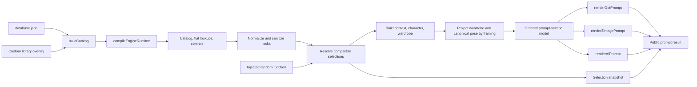

# Prompt Engine Architecture

Status: implemented on `main` in `7aed676 Optimize prompt engine runtime`

Last updated: 2026-07-18

## Purpose

This document defines the current boundary around `webapp/src/lib/engine.js`. It records the runtime, prompt-model, renderer, randomness, selection-schema, bundling, and compatibility decisions introduced by the 2026-07-10 optimization.

The objective is to make future prompt changes safer and faster without changing the public saved-card or prompt-output contracts.

## Pipeline



The default-library path compiles the runtime once and reuses it. A custom-library overlay follows the same pipeline but is recompiled per request so local changes cannot reuse stale catalog data.

## Module Ownership

| File | Responsibility |
| --- | --- |
| `webapp/src/lib/engine.js` | Public engine API, catalog compilation, compatibility rules, selection resolution, character/wardrobe orchestration, and prompt renderers |
| `webapp/src/lib/engineRandom.js` | Seed hashing, deterministic PRNG creation, and production fallback to `Math.random` |
| `webapp/src/lib/engine/runtimeCache.js` | Default-runtime memoization and recursive freezing |
| `webapp/src/lib/engine/promptModel.js` | Ordered prompt sections plus grouped label lookup used by renderers |
| `webapp/src/lib/engine/promptOutputContracts.js` | Machine-readable public contracts and validation for Gpt, Grok/Z-Image, AI, and full-body character outputs |
| `webapp/src/lib/engine/representativePromptFixtures.js` | Seeded normal, character-card, special-outfit, duo, fixed-set, close-up, and full-body regression scenarios |
| `webapp/src/lib/engine/compositionVisibilityContract.js` | Canonical framing buckets plus shared wardrobe, pose, scene, and selection-preservation projection policies |
| `webapp/src/lib/engine/fixedCompositionPromptProjection.js` | Renderer-neutral fixed-composition projection containing resolved wardrobe/colors, canonical pose text, composition metadata, and fixed-set scene selections |
| `webapp/src/lib/engine/compositionVisibilityFixtures.js` | Desired deterministic cases for normal wardrobe, dresses, presets, special outfits, Character Cards, duo, pose/support, scene, and full-body restoration |
| `webapp/src/lib/engine/promptTextDeduplication.js` | Conservative exact-fragment cleanup and explicit outfit-color materialization |
| `webapp/src/lib/engine/selectionSchema.js` | Schema-ordered selection snapshots and default filling |
| `webapp/src/lib/engine/characterProfiles.js` | Built-in character profile data |
| `webapp/src/lib/characterCardLab.js` | PAGE2 Character Card projection, removable layers, copy-output construction, and PAGE1 import payloads |
| `webapp/src/lib/engine/duoOptions.js` | Duo pose, posture, and shared-expression option data |
| `webapp/src/lib/engine/fixedCompositionOptions.js` | Fixed-composition set option data |
| `webapp/src/lib/engine/poseComposerOptions.js` | Single-subject Pose Composer option data |
| `webapp/src/data/database.json` | Synced base prompt catalog generated from the markdown knowledge base |
| `webapp/src/App.jsx` | PAGE1 state and UI-level control filtering; it should consume engine helpers instead of rebuilding control state |

Static option modules should remain data-focused. Compatibility migrations, cross-category resolution, and public API behavior stay at the engine boundary until a later extraction has sufficient regression coverage.

## Runtime Cache Contract

`compileEngineRuntime()` produces one object containing:

- the grouped catalog;
- flattened high-frequency lookup lists;
- the merged database snapshot;
- lock-control definitions and options.

`createEngineRuntimeResolver()` applies these rules:

1. `getEngineRuntime()` and `getEngineRuntime([])` reuse the same default runtime.
2. The cached default runtime is deeply frozen to prevent accidental mutation of catalog or control state.
3. A non-empty array or object custom library is compiled on every call.
4. Custom-library caching must not be added without a reliable version or invalidation key.

The cache removes repeated catalog parsing, legacy-ID application, metadata inference, option flattening, and lock-control construction from normal prompt generation.

## Randomness and Reproduction

Production behavior remains random by default:

```js
generatePrompts(1, locks, customLibrary)
```

Tests, diagnostics, and bug reports can inject deterministic randomness:

```js
import {
  createEmptyLocks,
  createSeededRandom,
  generatePrompts,
} from './webapp/src/lib/engine.js'

const prompts = generatePrompts(4, createEmptyLocks(), [], {
  random: createSeededRandom('portrait-regression'),
})
```

The same seed reproduces resolved prompt content and selections. `id` and `date` are intentionally runtime metadata and should be excluded when comparing deterministic fixtures.

Run the repository-level heuristic audit with:

```bash
node scripts/validate_prompt_logic.mjs 200 optimization-audit
```

Arguments are prompt count followed by seed. Add `--json` for a machine-readable report or `--strict` for the blocking contract gate. Strict mode fails on output-contract errors, exact duplicates, public control-language leakage, or contradictory constraints. Legacy wardrobe/scene heuristics and near-duplicate signals stay diagnostic.

## Prompt Model and Renderers

`buildStructuredPromptSections()` builds one shared model:

- `sections`: ordered `{ label, value }` entries for full-fidelity rendering;
- `valuesByLabel`: grouped values for format-specific lookup and compression;
- runtime context such as character, wardrobe, colors, lighting, film, and optical effects.

The renderers then apply format-specific rules:

- `renderGptPrompt()`: detailed, structured, full-fidelity output;
- `renderZImagePrompt()`: natural-language Grok/Z-Image output;
- `renderAiPrompt()`: compact AI output, including a specialized duo renderer.

Section labels are not merely display text. Renderers query labels such as `Subject`, `Location`, `Ambient Light Conditions`, and `Camera / Film`; renaming or splitting them is a cross-renderer schema change and requires prompt-pipeline tests.

## Composition Visibility Contract

`engine/compositionVisibilityContract.js` records the approved PAGE1 crop policy separately from renderer formatting. Version 1 distinguishes `faceDetail`, `headShoulders`, `chestUp`, `mediumWaist`, `cowboyKnee`, `fullBody`, and `unconstrained`; the distinction between Head-and-shoulders and Chest-up must not be collapsed back into one generic portrait bucket.

The contract owns these projection boundaries:

- raw wardrobe, Pose Composer, scene, Character Card, and body selections remain preserved regardless of framing;
- the three primary outputs consume one shared visible projection rather than applying renderer-specific crop filters;
- projected canonical pose text is exact across Gpt, Grok/Z-Image, and AI, while `faceDetail` and `headShoulders` intentionally project it to empty;
- compact near-crop scene text remains source-traceable and never invents blur, bokeh, or shallow depth of field;
- the full-body character output uses complete resolved wardrobe data, not the main crop projection.

Phase 1 added the contract, desired-output fixtures, and structural tests only. Phase 2 makes PAGE1 close-up state non-destructive: UI availability may disable controls, but normalization, `vps.locks`, generated `selection`, Saved Cards restore, Character Card selection, body settings, wardrobe, Pose Composer, contact/support, and scene locks retain their source values. Returning to a wider crop restores the same selections without reconstructing them from Prompt text.

Phase 2 also established the first runtime projection boundary for `faceDetail`: the three main outputs omit normal and complete-look wardrobe text while the single-subject full-body character output continues to render the complete resolved wardrobe.

Phase 3 creates one canonical wardrobe projection from the selected framing and attaches it to the shared renderer context. Gpt, Grok/Z-Image, and AI now reuse its role decisions for `headShoulders`, `chestUp`, `mediumWaist`, and `cowboyKnee`, including normal separates, dresses, outfit presets, mixed-fragment special outfits, Character Card layers/accessories, and duo role wardrobes. Long complete-look descriptions split garment identity from out-of-frame regional details; cowboy framing conditionally retains thigh-/knee-visible legwear but not shoes. Raw selections remain untouched, and the dedicated full-body character context creates a separate `fullBody` projection so it restores the complete outfit.

Phase 4 resolves a single projected canonical Pose Composer sentence before renderer formatting. `faceDetail` and `headShoulders` return an empty pose; `chestUp` retains only head, visible upper-body motion, crop-compatible hand/prop action, and high shoulder/back support; `mediumWaist` retains head, crop-compatible hands/props, upper-body motion, and the pose base while dropping lower-body arrangements and low support; `cowboyKnee` retains the pose through knee level while replacing foot-only arrangements with the pose base; `fullBody` and `unconstrained` reuse the original canonical sentence byte-for-byte. Gpt, Grok/Z-Image, and AI read the same projected string, including Character Card and dedicated special-subject routes, so no renderer may independently compress or reinsert the source pose. Selection snapshots keep every resolved Pose Composer ID, and widening the framing reconstructs the full canonical sentence from those preserved IDs.

Phase 5 resolves a shared `projectedScene` from the same composition-visibility projection before renderer formatting. `compactSource` retains the first three visual clauses from the selected location or imported world-scene source, `conciseSource` retains the first five, and `fullSource` preserves the complete cleaned source. Compact crops omit optional contextual scene accents; concise and full crops may restore only source-traceable accent clauses. Gpt, Grok/Z-Image, and AI consume that same structured projection and may apply only their existing outer grammar or model-specific source reduction. Scene projection must not invent blur, bokeh, shallow depth of field, faint background shapes, framing-expansion requests, or public scene-priority guidance. Raw `locationId` and imported-scene selections remain unchanged so a wider crop restores all source anchors. Dedicated fixed composition sets continue through their specialized renderer contract and are intentionally not rewritten by this projection.

Fixed-composition visibility phase 2 upgrades the contract to version 2 and adds the `fixedComposition` bucket. A fixed set does not inherit the ordinary `unconstrained` meaning from its UI-level `framingId = 全無`; its composition source is the selected fixed set, its camera distance is fixed-set-defined, and manual framing remains disabled. The bucket exposes complete wardrobe roles, full canonical pose parts, and `fixedSetContract` scene semantics so downstream phases can consume one explicit context without reopening normal framing controls. `generateSinglePrompt()` resolves this projection before character and wardrobe construction, and all renderer fallbacks reuse it. Public Prompt text, fixed-set option IDs, selection mappings, and the dedicated fixed-set scene renderer remain unchanged in this phase.

Fixed-composition visibility phase 3 creates one `fixedCompositionPromptProjection` after wardrobe, color, and canonical pose resolution. It freezes a renderer-neutral wrapper around the shared composition metadata, resolved wardrobe items and colors, canonical pose text, and fixed-set scene selections. `buildPrompts()` reconstructs the fixed renderer context and supplies Gpt, Grok/Z-Image, and AI with the same projected wardrobe and scene option references; the independent full-body character model explicitly returns to the original complete wardrobe source. This phase changes no public wording or paragraph order. In particular, the existing Grok/Z-Image fixed-scene-first layout remains temporary and is corrected only in the renderer-order phase.

## Character-card identity flow

Formal Character Card identity data enters from `engine/characterProfiles.js`; this is the only source that may define a card's stable face, body, hair, locked wardrobe, and preview metadata. `getLockControls()` exposes each formal profile to PAGE1. `getCharacterCardOptions()` in `characterCardLab.js` projects the same profile into PAGE2, adds card-safe hair/layer controls, and preserves a selected card in Saved Card / PAGE1 import payloads.

When a formal profile is selected, `engine.js` resolves its profile groups and uses them in both PAGE1 subject construction and the dedicated full-body renderer:

- Full Gpt / full-body outputs render `facialGeometry`, `eyeSignature`, `noseSignature`, `mouthSignature`, `skinSignature`, `makeup`, `body`, and `distinctiveFeatures` as the canonical ordered identity blocks before mutable hair and wardrobe. They do not repeat the complete legacy paragraph.
- Grok/Z-Image uses the resolved card subject with the permanent anchors included.
- Compact AI uses a short base identity phrase but independently appends all four `distinctiveFeatures` fragments before hair variants and selected accessories. Compression must not remove an anchor.
- PAGE2's six copy outputs use the same profile projection and explicitly include permanent identity anchors.

Stable identity fields are facial geometry, eye/nose/mouth/skin signatures, body proportions, natural marks, and permanent supernatural anatomy. Hair, garments, removable glasses/accessories, makeup, pose, scene, lighting, camera, and rendering grade are replaceable styling or presentation. `distinctiveFeatures` must remain independent because it is the small, ordered set that survives compact rendering and prevents style changes from becoming identity changes.

`identityAndBody` remains a historical compatibility string. Profiles retain it verbatim as `legacyIdentityAndBody`; do not derive it from or replace it in compatibility data. New full renderers use the structured fields instead of serializing both representations together. This protects Saved Cards, PAGE1/PAGE2 import and restore paths, legacy prompt consumers, and existing stored browser data without duplicating prompt instructions. Tests own the responsibility to verify both schemas, every prompt format, both wardrobe modes, and high-similarity pair contrasts. The full contract and matrix are in [`character-card-facial-identity.md`](character-card-facial-identity.md).

## Public Compatibility Contracts

The output fields retain historical source names:

| UI label | Public field | Meaning |
| --- | --- | --- |
| `Gpt` | `grokPrompt` | Full-fidelity GPT Image / ChatGPT Image prompt |
| `Grok/Z-Image` | `zImagePrompt` | Natural Grok Imagine / Z-Image prompt |
| `AI` | `midjourneyPrompt` | Compact general image-model prompt |

Do not rename these fields as a cleanup-only change. They are consumed by PAGE1 previews, saved cards, import/restore flows, DLL PIC Pro prompt sources, tests, and historical browser data.

Additional compatibility rules:

- `LOCK_DEFINITIONS` is the source of truth for empty locks and selection snapshot keys.
- `createSelectionSnapshot()` preserves schema order, fills declared defaults, and drops undeclared values.
- Legacy lock IDs must be normalized before selection resolution.
- Existing close-up, special-subject, character-card, duo, fixed-composition, and saved-card migration behaviors remain public engine behavior.
- Seeded randomness is a testing and diagnostic interface, not a promise that IDs or timestamps are stable.

## Bundling

`webapp/vite.config.js` defines these manual chunks:

- `prompt-catalog` for `database.json`;
- `prompt-engine` for `engine.js` and `engine/` modules;
- Firebase remains in its own dependency chunk through Rollup's normal dependency grouping;
- the remaining application code stays in the main bundle.

This makes bundle ownership visible and removed the previous single-chunk size warning. It is an output split, not a guarantee that every chunk is route-lazy-loaded.

Build snapshot from 2026-07-10:

| Chunk | Minified size | Gzip size |
| --- | ---: | ---: |
| Main application | 499.72 kB | 151.11 kB |
| Prompt engine | 484.38 kB | 131.01 kB |
| Prompt catalog | 328.58 kB | 103.99 kB |
| Firebase | 300.73 kB | 93.33 kB |

Chunk sizes are diagnostic snapshots and will change with features, dependencies, and catalog growth.

## Performance Snapshot

Local development measurement on 2026-07-10:

- architecture: arm64;
- Node: `v22.22.3`;
- npm: `10.9.8`;
- default catalog path, comparing the pre-optimization and optimized worktrees.

| Operation | Before | After |
| --- | ---: | ---: |
| `getLockControls()` | ~23.75 ms/op | <0.001 ms/op after cache warm-up |
| `generatePrompts(1)` | ~98.68 ms | ~2.98 ms |
| `generatePrompts(10)` | ~928.6 ms | ~29.95 ms |
| Frontend test suite | ~29.0 s | ~3.23 s |

These are development measurements, not SLAs. A valid future comparison should keep the machine, Node version, database, prompt count, test command, and warm/cold-cache conditions equivalent.

## Validation

Run targeted tests first when editing a focused module, then the full checks:

```bash
cd webapp
npm test
npm run lint
npm run build
```

Relevant focused tests include:

- `src/lib/engineRandom.test.js`;
- `src/lib/engine/runtimeCache.test.js`;
- `src/lib/engine/promptModel.test.js`;
- `src/lib/engine/selectionSchema.test.js`;
- `src/lib/engine/promptOutputContracts.test.js`;
- `src/lib/engine/compositionVisibilityContract.test.js`;
- `src/lib/enginePromptDeduplication.test.js`;
- `src/lib/enginePromptPipeline.test.js`;
- the feature-specific engine tests for wardrobe, character cards, Pose Composer, lighting, close-up, duo, and saved-card behavior.

When prompt wording or compatibility logic changes, also run a seeded heuristic sample and a browser smoke test across all five active pages.

The standard prompt-quality entry points from `webapp/` are:

```bash
npm run test:prompt-quality
npm run audit:prompts
npm run audit:prompts:strict
```

## Safe Follow-Up Sequence

The current optimization deliberately leaves high-coupling behavior in `engine.js`. Continue in small, tested steps:

1. Add seeded fixtures around the exact behavior being moved.
2. Extract pure character resolution from `buildCharacter()` without changing public output.
3. Extract wardrobe resolution in narrower layers rather than moving `buildWardrobe()` wholesale.
4. Isolate legacy migration only after its saved-card inputs and normalized outputs are versioned by tests.
5. Consider custom-library caching only after introducing an explicit revision key.
6. Re-run focused tests, the full frontend and Functions suites, lint, build, deterministic audit, and browser smoke tests.

Avoid mixing a compatibility migration, output wording change, and performance refactor in the same commit. The seeded generator makes each of those changes easier to evaluate separately.
