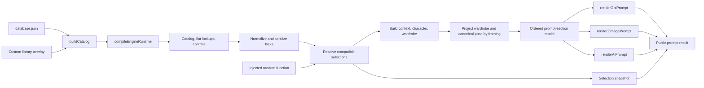

# Prompt Engine Architecture

Status: implemented on `main` in `7aed676 Optimize prompt engine runtime`

Last updated: 2026-07-22

## Purpose

This document defines the current boundary around `webapp/src/lib/engine.js`. It records the runtime, prompt-model, renderer, randomness, selection-schema, bundling, and compatibility decisions introduced by the 2026-07-10 optimization.

The objective is to make future prompt changes safer and faster without changing the public saved-card or prompt-output contracts.

## Pipeline



The default-library path compiles the runtime once and reuses it. A custom-library overlay follows the same pipeline but is recompiled per request so local changes cannot reuse stale catalog data.

## Module Ownership

| File | Responsibility |
| --- | --- |
| `webapp/src/lib/engine.js` | Public engine API, catalog compilation, compatibility rules, selection resolution, character/wardrobe orchestration, and prompt renderers |
| `webapp/src/lib/engineRandom.js` | Seed hashing, deterministic PRNG creation, and production fallback to `Math.random` |
| `webapp/src/lib/engine/runtimeCache.js` | Default-runtime memoization and recursive freezing |
| `webapp/src/lib/engine/promptModel.js` | Ordered prompt sections plus grouped label lookup used by renderers |
| `webapp/src/lib/engine/promptOutputContracts.js` | Machine-readable public contracts and validation for Gpt, Grok/Z-Image, AI, and full-body character outputs |
| `webapp/src/lib/engine/representativePromptFixtures.js` | Seeded normal, character-card, special-outfit, duo, fixed-set, close-up, and full-body regression scenarios |
| `webapp/src/lib/engine/aiPromptLengthContract.js` | Single-subject AI word budgets, immutable sections, preservation anchors, and ordered reduction policy |
| `webapp/src/lib/engine/aiPromptLengthFixtures.js` | Deterministic AI length-pressure cases for normal separates, complete looks, Character Cards, pose, crop, and duo exclusion |
| `webapp/src/lib/engine/aiPromptLengthIntegration.test.js` | Phase-6 blocking gate for historical mappings, contracts, resolved selections, anchors, budgets, canonical pose, and duo exclusion |
| `webapp/src/lib/engine/aiPromptBudget.js` | Section-aware single-subject AI assembly, policy resolution, word measurements, and budget diagnostics |
| `webapp/src/lib/engine/compositionVisibilityContract.js` | Canonical framing buckets plus shared wardrobe, pose, scene, and selection-preservation projection policies |
| `webapp/src/lib/engine/fixedCompositionPromptProjection.js` | Renderer-neutral fixed-composition projection containing resolved wardrobe/colors, canonical pose text, composition metadata, and fixed-set scene selections |
| `webapp/src/lib/engine/compositionVisibilityFixtures.js` | Desired deterministic cases for normal wardrobe, dresses, presets, special outfits, Character Cards, duo, pose/support, scene, and full-body restoration |
| `webapp/src/lib/engine/fixedFramingDerivedPromptContract.js` | Behavior-neutral target contract for facial-closeup and chest-up derived outputs, simplified main-framing visibility, legacy ID preservation, and half-face edge placement |
| `webapp/src/lib/engine/fixedFramingDerivedPromptFixtures.js` | Seeded target cases for separates, special outfits, presets, dresses, Character Cards, upper-garment fallback, fixed-set scene sources, viewpoint compatibility, duo absence, and half-face placement |
| `webapp/src/lib/engine/promptTextDeduplication.js` | Conservative exact-fragment cleanup and explicit outfit-color materialization |
| `webapp/src/lib/engine/selectionSchema.js` | Schema-ordered selection snapshots and default filling |
| `webapp/src/lib/engine/characterProfiles.js` | Built-in character profile data |
| `webapp/src/lib/characterCardLab.js` | PAGE2 Character Card projection, removable layers, copy-output construction, and PAGE1 import payloads |
| `webapp/src/lib/engine/duoOptions.js` | Duo pose, posture, and shared-expression option data |
| `webapp/src/lib/engine/fixedCompositionOptions.js` | Fixed-composition set option data |
| `webapp/src/lib/engine/poseComposerOptions.js` | Single-subject Pose Composer option data |
| `webapp/src/data/database.json` | Synced base prompt catalog generated from the markdown knowledge base |
| `webapp/src/App.jsx` | PAGE1 state and UI-level control filtering; it should consume engine helpers instead of rebuilding control state |

Static option modules should remain data-focused. Compatibility migrations, cross-category resolution, and public API behavior stay at the engine boundary until a later extraction has sufficient regression coverage.

## Runtime Cache Contract

`compileEngineRuntime()` produces one object containing:

- the grouped catalog;
- flattened high-frequency lookup lists;
- the merged database snapshot;
- lock-control definitions and options.

`createEngineRuntimeResolver()` applies these rules:

1. `getEngineRuntime()` and `getEngineRuntime([])` reuse the same default runtime.
2. The cached default runtime is deeply frozen to prevent accidental mutation of catalog or control state.
3. A non-empty array or object custom library is compiled on every call.
4. Custom-library caching must not be added without a reliable version or invalidation key.

The cache removes repeated catalog parsing, legacy-ID application, metadata inference, option flattening, and lock-control construction from normal prompt generation.

## Randomness and Reproduction

Production behavior remains random by default:

```js
generatePrompts(1, locks, customLibrary)
```

Tests, diagnostics, and bug reports can inject deterministic randomness:

```js
import {
  createEmptyLocks,
  createSeededRandom,
  generatePrompts,
} from './webapp/src/lib/engine.js'

const prompts = generatePrompts(4, createEmptyLocks(), [], {
  random: createSeededRandom('portrait-regression'),
})
```

The same seed reproduces resolved prompt content and selections. `id` and `date` are intentionally runtime metadata and should be excluded when comparing deterministic fixtures.

Run the repository-level heuristic audit with:

```bash
node scripts/validate_prompt_logic.mjs 200 optimization-audit
```

Arguments are prompt count followed by seed. Add `--json` for a machine-readable report or `--strict` for the blocking contract gate. Strict mode fails on output-contract errors, exact duplicates, public control-language leakage, or contradictory constraints. Legacy wardrobe/scene heuristics and near-duplicate signals stay diagnostic.

## Prompt Model and Renderers

`buildStructuredPromptSections()` builds one shared model:

- `sections`: ordered `{ label, value }` entries for full-fidelity rendering;
- `valuesByLabel`: grouped values for format-specific lookup and compression;
- runtime context such as character, wardrobe, colors, lighting, film, and optical effects.

The renderers then apply format-specific rules:

- `renderGptPrompt()`: detailed, structured, full-fidelity output;
- `renderZImagePrompt()`: natural-language Grok/Z-Image output;
- `renderAiPrompt()`: compact AI output, including a specialized duo renderer.

Midjourney V8 parameter phase 5 keeps `renderAiPrompt()` as the sole descriptive-content producer, then passes its completed output through `renderMidjourneyNativeDescription()`. This projection emits one text-prompt block by normalizing only inter-section whitespace; it preserves every authored token, sentence, punctuation mark, section order, Body Type anchor, and projected canonical pose. `appendMidjourneyParameterTail()` remains the final operation, so the output shape is one descriptive block followed by one contract-ordered tail. The same projection applies to single and duo AI outputs; Gpt, Grok/Z-Image, and all fixed-framing derived outputs bypass it. The phase does not authorize Midjourney-specific content reauthoring.

AI length optimization phase 1 is behavior-neutral. It records separate normal, complete-look, and Character Card word budgets, plus the immutable image-type, composition, and projected canonical-pose sections. Deterministic fixtures capture the longest known outfit-preset, special-outfit, Character Card, pose, and crop pressure without changing `renderAiPrompt()`. The contract explicitly excludes duo AI, prohibits hard string/word truncation, and fixes the future semantic reduction order so later phases cannot shorten identity or canonical pose merely to satisfy a numeric target.

AI length optimization phase 2 is also behavior-neutral. `renderAiPrompt()` now names its seven single-subject producer outputs and passes them through `createAiPromptSectionModel()`, which orders sections, marks immutable content, selects the normal／complete-look／Character Card budget, and measures over-target words before recomposing the original strings. Duo AI remains on its existing renderer. The deterministic phase-1 outputs are locked by SHA-256 so infrastructure changes cannot silently alter punctuation, paragraph spacing, selection semantics, or public Prompt text.

AI length optimization phase 3 activates source-local reduction in the existing normal-subject and complete-look producers. Normal Body Type text drops generic silhouette endings while retaining authored proportion and regional body anchors; hairstyle fragments remain intact and hair color keeps its primary source phrase. Complete looks are grouped by the shared visible wardrobe roles, then retain the style identity, up to two primary garment fragments per major role, one legwear and footwear fragment, and one necessary accessory. Long fragments reduce to their source garment head plus explicitly recognized source signature phrases. Character Card identity／wardrobe, scene, imaging, duo, canonical pose, raw selections, and the other public outputs are unchanged.

AI length optimization phase 4 activates only the Character Card subject and default wardrobe producers. When structured permanent identity anchors exist, AI uses those four authored face anchors as the canonical compact face representation rather than repeating facial geometry, eye, nose, and mouth groups. It additionally retains compact source skin and makeup anchors, the composition-projected body source, principal hair shape and signature color treatment, effective eyewear／headphones, and every user-selected hair variant or prompt override. Default outfit projection keeps one principal source garment per visible wardrobe role; selected Character Card accessory text remains complete. Normal and complete-look outputs keep phase-3 behavior, while scene, imaging, duo, canonical pose, raw selections, compatibility fields, Gpt, Grok-Z, and derived outputs are unchanged.

AI length optimization phase 5 extends the section model with deterministic soft-max arbitration. Each producer may supply complete-sentence, source-derived alternatives, but arbitration considers them only when the assembled single-subject output exceeds its policy soft max. The fixed reduction order is imaging, scene, wardrobe, then subject; phase 5 supplies alternatives only for imaging and eligible cropped scenes. Compact imaging keeps the selected photographer/style, lens identity, optical effect, and film/rendering identity while deleting their secondary explanatory clauses. Cropped scene alternatives progressively keep the projected location identity and fewer secondary anchors. Full-body, unconstrained, and fixed-composition contexts do not expose scene alternatives, preserving their complete shared scene contract. Image type, composition, and projected canonical pose are never reduced. The model records initial/final words and every applied section reduction; it has no hard-truncation path. Already-compliant output text remains byte-stable.

AI length optimization phase 6 adds the behavior-neutral blocking integration gate and changes no production Prompt text. The gate generates all ten deterministic length fixtures through `generatePrompts()`, validates `grokPrompt`, `zImagePrompt`, and `midjourneyPrompt` against their historical public contracts, verifies compatible resolved selections, required AI anchors, per-policy soft max, and exact canonical-pose reuse, and records the single-only／duo-excluded and immutable-section boundaries. `npm run test:prompt-quality` includes this gate, so a future renderer, option, Character Card, crop, or output-mapping change cannot bypass the completed six-phase policy silently.

Section labels are not merely display text. Renderers query labels such as `Subject`, `Location`, `Ambient Light Conditions`, and `Camera / Film`; renaming or splitting them is a cross-renderer schema change and requires prompt-pipeline tests.

## Composition Visibility Contract

`engine/compositionVisibilityContract.js` records the approved PAGE1 crop policy separately from renderer formatting. Version 1 distinguishes `faceDetail`, `headShoulders`, `chestUp`, `mediumWaist`, `cowboyKnee`, `fullBody`, and `unconstrained`; the distinction between Head-and-shoulders and Chest-up must not be collapsed back into one generic portrait bucket.

The contract owns these projection boundaries:

- raw wardrobe, Pose Composer, scene, Character Card, and body selections remain preserved regardless of framing;
- the three primary outputs consume one shared visible projection rather than applying renderer-specific crop filters;
- projected canonical pose text is exact across Gpt, Grok/Z-Image, and AI, while `faceDetail` and `headShoulders` intentionally project it to empty;
- compact near-crop scene text remains source-traceable and never invents blur, bokeh, or shallow depth of field;
- the full-body character output uses complete resolved wardrobe data, not the main crop projection.

Phase 1 added the contract, desired-output fixtures, and structural tests only. Phase 2 makes PAGE1 close-up state non-destructive: UI availability may disable controls, but normalization, `vps.locks`, generated `selection`, Saved Cards restore, Character Card selection, body settings, wardrobe, Pose Composer, contact/support, and scene locks retain their source values. Returning to a wider crop restores the same selections without reconstructing them from Prompt text.

Phase 2 also established the first runtime projection boundary for `faceDetail`: the three main outputs omit normal and complete-look wardrobe text while the single-subject full-body character output continues to render the complete resolved wardrobe.

Phase 3 creates one canonical wardrobe projection from the selected framing and attaches it to the shared renderer context. Gpt, Grok/Z-Image, and AI now reuse its role decisions for `headShoulders`, `chestUp`, `mediumWaist`, and `cowboyKnee`, including normal separates, dresses, outfit presets, mixed-fragment special outfits, Character Card layers/accessories, and duo role wardrobes. Long complete-look descriptions split garment identity from out-of-frame regional details; cowboy framing conditionally retains thigh-/knee-visible legwear but not shoes. Raw selections remain untouched, and the dedicated full-body character context creates a separate `fullBody` projection so it restores the complete outfit.

Phase 4 resolves a single projected canonical Pose Composer sentence before renderer formatting. `faceDetail` and `headShoulders` return an empty pose; `chestUp` retains only head, visible upper-body motion, crop-compatible hand/prop action, and high shoulder/back support; `mediumWaist` retains head, crop-compatible hands/props, upper-body motion, and the pose base while dropping lower-body arrangements and low support; `cowboyKnee` retains the pose through knee level while replacing foot-only arrangements with the pose base; `fullBody` and `unconstrained` reuse the original canonical sentence byte-for-byte. Gpt, Grok/Z-Image, and AI read the same projected string, including Character Card and dedicated special-subject routes, so no renderer may independently compress or reinsert the source pose. Selection snapshots keep every resolved Pose Composer ID, and widening the framing reconstructs the full canonical sentence from those preserved IDs.

Phase 5 resolves a shared `projectedScene` from the same composition-visibility projection before renderer formatting. `compactSource` retains the first three visual clauses from the selected location or imported world-scene source, `conciseSource` retains the first five, and `fullSource` preserves the complete cleaned source. Compact crops omit optional contextual scene accents; concise and full crops may restore only source-traceable accent clauses. Gpt, Grok/Z-Image, and AI consume that same structured projection and may apply only their existing outer grammar or model-specific source reduction. Scene projection must not invent blur, bokeh, shallow depth of field, faint background shapes, framing-expansion requests, or public scene-priority guidance. Raw `locationId` and imported-scene selections remain unchanged so a wider crop restores all source anchors. Dedicated fixed composition sets continue through their specialized renderer contract and are intentionally not rewritten by this projection.

### Body visibility optimization

Body-visibility optimization phase 1 was the behavior-neutral specification and regression-baseline phase. `engine/compositionBodyVisibilityFixtures.js` records the desired shared body source for every public Body Type and the deterministic single, duo, Character Card, special-outfit, selection-preservation, and full-body-reference scenarios. `engine/compositionBodyVisibilityContract.test.js` blocks incomplete or out-of-source fixture changes.

Phase 2 upgrades `compositionVisibilityContract` to version 3 and activates the body policy for the six normal single-subject Body Types. `compositionBodyProjection.js` maps the resolved canonical Body Type to its authored crop-specific source once, before `buildStructuredPromptSections()` and the three public renderer paths. Gpt receives the complete projected source; Grok/Z-Image and AI may only reduce that projected source under their existing output contracts. Face and head-shoulder crops remove the Body Type item, chest/medium/cowboy crops progressively restore visible body zones, and full-body/unconstrained/fixed-composition contexts keep the complete canonical source. The raw `bodyTypeId` selection is never changed, and the independent single-subject full-body character model explicitly uses the original unprojected character source.

Phase 2 is intentionally limited to normal single-subject Body Types. Duo A/B Body Types, structured Character Card `body`, and body fragments embedded in special-outfit person details remain on their existing behavior until the compatibility-source phase. Wardrobe projection, Pose Composer, scene projection, fixed-composition behavior, public field mappings, storage keys, and UI disabled-state rules are unchanged.

Phase 3 is the compatibility-source phase. Duo A/B items now reuse the same canonical Body Type projector before all three role renderers, including the previously wardrobe-only Grok/Z-Image and AI role blocks. Every formal Character Card owns authored `profile.bodyProjection` text beside its canonical structured `body`; cropped renderers consume the projected structured identity and never parse `identityAndBody`, which remains unchanged for storage and legacy consumers. Special-outfit built-in hair remains a person detail at every crop, while chest/arm tattoo fragments follow body visibility and are restored by chest-up or wider compositions. The independent full-body character model still receives the original subject, character, and special-outfit sources. No wardrobe role, pose, scene, imaging, UI, storage, or public output-field contract changes in this phase.

Phase 4 is the final blocking-integration phase and changes no production renderer. `engine/compositionBodyPromptIntegration.test.js` consumes the data-only phase-4 matrix from `compositionBodyVisibilityFixtures.js` and generates every public framing alias for all six Body Types, the approved duo A/B profiles, every formal Character Card, every tattoo-bearing special outfit, and the fixed-composition full-source boundary. It verifies the three historical primary output fields, raw selection preservation, permanent Character Card identity anchors, body omission or progressive restoration, and independent full-body-character restoration. The suite is part of `npm run test:prompt-quality`, so future framing aliases, Body Types, Character Cards, or tattoo-bearing special outfits cannot bypass the completed body policy silently.

The approved target body policy is:

| Composition bucket | Body mode | Visible body source |
| --- | --- | --- |
| `faceDetail` | `omit` | No Body Type or Character Card `body`; face identity, skin, makeup, hair, expression, and face accessories remain available. |
| `headShoulders` | `omit` | No Body Type or Character Card `body`; the same non-body identity groups remain available. |
| `chestUp` | `visibleZones` | Chest and visible upper-body morphology only; no height, weight, three-number body anchor, waist, abdomen, hips, legs, or torso-to-leg ratio. |
| `mediumWaist` | `visibleZones` | Chest, torso, waist, and abdomen; no height, weight, hips, legs, torso-to-leg ratio, or complete body anchor. |
| `cowboyKnee` | `visibleZones` | Chest, torso, waist, abdomen, and hips; no visual height/weight, long-leg pressure, or torso-to-leg ratio. |
| `fullBody` | `fullSource` | Complete canonical body source. |
| `unconstrained` | `fullSource` | Complete canonical body source. |
| `fixedComposition` | `fullSource` | Preserve the current fixed-set contract until fixed sets define their own body-distance metadata. |

Every activated runtime projection must occur once before renderer formatting. Gpt may preserve the complete projected source, while Grok/Z-Image and AI may reduce only that projected source and must not read the hidden full-body source as a fallback. Raw body locks, Saved Cards, restore payloads, and generated selections remain unchanged. The single-subject full-body character output always restores the complete body source. `identityAndBody` remains a compatibility field; structured Character Card `body` is the preferred projection surface for its later compatibility phase, and permanent face identity anchors must never be removed with body text.

### Fixed-framing derived Prompt outputs

Fixed-framing derived Prompt phase 1 was behavior-neutral. `engine/fixedFramingDerivedPromptContract.js` recorded two single-subject `extraPrompts`: `facial-closeup-portrait` (`五官特寫照`, fixed `1:1`) and `chest-up-portrait` (`胸上特寫照`, fixed `4:5`). They are distinct from the existing fixed-composition scene feature. A derived output reuses the exact same resolved subject, wardrobe, color, pose, scene, lighting, and imaging sources as its parent PAGE1 result; it must never call selection resolution again or reroll any source value.

Phase 2 introduces the shared runtime infrastructure in `engine/fixedFramingDerivedPrompt.js`. A frozen preset owns the derived output identity, aspect ratio, framing object, supported mode, and fixed-composition handling; `createFixedFramingDerivedContext()` replaces only framing-dependent projection state while retaining the parent's already-resolved nested sources. `engine.js` builds a derived structured Prompt model from those same sources and routes the existing `full-body-character` output through this core first. The migration is deliberately byte-preserving: its public ID, label, single-subject boundary, fixed `9:16`, section order, wording, and complete body/wardrobe restoration remain unchanged. `facial-closeup-portrait` and `chest-up-portrait` remain absent until phase 3.

Phase 3 activates both new presets in the PAGE1 runtime and `extraPrompts` for single-subject results. The face preset combines the `faceDetail` body/pose boundary with an authored upper-garment wardrobe projection, while the chest preset uses the canonical `chestUp` body, wardrobe, pose, and compact-scene projection. Both use the full-fidelity structured renderer with `Image Type`, labeled `Composition`, `Subject`, optional projected content sections, and no `multi-cut` tail. A fixed-composition source becomes a compact scene identity/anchor projection before its fixed-set camera distance and control language can reach the derived renderer. The main three public fields and the full-body character bytes remain unchanged; duo results contain none of these three single-subject extras.

Phase 4 connects the three single-subject extras to the live PAGE1 consumer model. `page1PromptOutputs.js` provides one ordered projection for both Generation Outputs and DLL PIC Pro: the historical Gpt, Grok/Z-Image, and AI fields first, followed by facial close-up, chest-up, and full-body character when their source text exists. DLL PIC Pro locks those three derived sources to `1:1`, `4:5`, and `9:16` respectively. The shared DLL ratio list now exposes `4:5`; because this ratio is currently verified only for the direct Google Gemini image route, `DllPicProPanel` disables generation and displays a compatibility message when a non-verified model is selected with the locked chest-up source. It does not silently substitute `3:4` or `9:16`. Duo results expose only the historical three primary sources because their `extraPrompts` collection is empty. This phase changes no Prompt text, renderer, resolved selection, storage record, or historical public field mapping.

Phase 5 activates the main-framing policy through `engine/fixedFramingMainPrompt.js`. PAGE1 exposes only `全無`, `半臉傾斜特寫`, medium, cowboy, and full-body options; unlocked engine resolution samples only the latter four concrete candidates. The four retired close-range options stay in the complete engine catalog for normalization, Saved Cards, browser storage, and restore compatibility. A currently restored legacy value is projected into PAGE1 as a disabled restore-only option, then disappears after the user selects a current option. Half-face generation resolves one seeded left- or right-edge opening once in the shared context, so Gpt, Grok/Z-Image, and AI receive identical geometry. Its visibility bucket is `headShoulders`: body and canonical pose remain omitted, while selected upper-garment neckline, shoulders, outerwear, and head/neck accessories stay available to match the explicitly visible upper torso.

Phase 6 completes the fixed-framing work with a blocking integration matrix and no renderer rewrite. The four current concrete framings cover separates, special outfits, outfit presets, and dresses across the three historical primary fields plus facial-closeup, chest-up, and full-body derived outputs. Every case preserves one resolved selection through PAGE1 cards and DLL prompt sources. All four retired framing IDs remain explicitly generatable and contract-valid only when restored, while unlocked single, Character Card, and duo generation can resolve only current candidates. Fixed-composition framing and duo extra-output boundaries remain independent. The gate changes fixtures, contract metadata, tests, the quality command, and documentation only; public Prompt text is unchanged.

The facial-closeup target uses the `faceDetail` body and pose boundary but extends visible wardrobe to the selected top, dress bodice, outerwear neckline, headwear, eyewear, earrings, and neck accessory. A visible upper garment is required; when none of the selected, complete-look, or Character Card sources provides one, the authored positive fallback is `a simple opaque crew-neck top`. The output omits pose, retains a compact source-traceable scene, preserves selected lighting and imaging, and substitutes a front view only inside the derived output when the raw orbit is rear-facing. Raw locks remain unchanged.

The chest-up target uses the existing `chestUp` body, wardrobe, pose, and compact-scene projection. It preserves the projected canonical head and upper-body pose, crop-compatible hand or prop action, high support/contact, selected scene, lighting, photography style, lens, optical effects, and rendering simulation. When a fixed-composition set is selected, both derived outputs preserve its scene identity and source anchors while omitting the fixed-set camera-distance statement that conflicts with the explicit derived crop. The existing `full-body-character` output remains unchanged after its phase-2 shared-infrastructure migration.

The phase-5 main-framing selector exposes only `全無`, `半臉傾斜特寫`, `中景鏡頭 (Medium Shot)`, `牛仔中景 (Cowboy Shot)`, and `全身鏡頭 (Full Body Shot)`. The existing IDs for `局部五官特寫`, `臉部特寫`, `特寫鏡頭 (Close-Up)`, and `胸上特寫` remain catalog-resolvable and restorable but are excluded from new UI selection and random candidates. The half-face target resolves one seeded placement, left or right, once per generated result and shares the exact opening across Gpt, Grok/Z-Image, and AI. Its geometry places the subject flush against one frame edge, crops the outer half of the face with that vertical boundary, preserves broad negative space on the opposite side, and keeps the neck, shoulders, and upper torso visible.

The phase-1 structural gate is `engine/fixedFramingDerivedPromptContract.test.js`, included in `npm run test:prompt-quality`. It verifies frozen serializable policy data, the exact current IDs and complete active/legacy partition, all target wardrobe and compatibility fixtures, both half-face sides, and activation state. The phase-2 infrastructure gate is `engine/fixedFramingDerivedPromptInfrastructure.test.js`; it continues to verify the frozen full-body preset, non-mutating derived context, `fullBody` projection, compatibility metadata, raw source-selection preservation, and exact full-body output bytes for deterministic normal, special-outfit, Character Card, and fixed-composition cases. The phase-3 runtime gate is `engine/fixedFramingDerivedPromptRuntime.test.js`; it covers upper-garment fallback, special outfit, outfit preset, dress, Character Card identity, projected chest pose, fixed-set scene projection, rear-orbit fallback, raw selections, and duo absence. `promptOutputContracts.js` and the strict audit validate all three extras. The phase-4 consumer gate is `page1PromptOutputs.test.js`; it verifies the six-source single order, the three-source duo boundary, exact source-text reuse, and all fixed DLL aspect ratios. The phase-5 gate is `engine/fixedFramingMainPrompt.test.js`; it verifies current-only UI options and random resolution, restore-only legacy values, both deterministic half-face sides, exact three-output composition reuse, upper-garment visibility, and raw framing preservation. The phase-6 gate is `engine/fixedFramingPromptIntegration.test.js`; it combines the current wardrobe/framing matrix, all restore-only IDs, unlocked single／Character Card／duo resolution, output contracts, PAGE1／DLL consumers, fixed-composition isolation, and duo absence into one blocking regression.

Fixed-composition visibility phase 2 upgrades the contract to version 2 and adds the `fixedComposition` bucket. A fixed set does not inherit the ordinary `unconstrained` meaning from its UI-level `framingId = 全無`; its composition source is the selected fixed set, its camera distance is fixed-set-defined, and manual framing remains disabled. The bucket exposes complete wardrobe roles, full canonical pose parts, and `fixedSetContract` scene semantics so downstream phases can consume one explicit context without reopening normal framing controls. `generateSinglePrompt()` resolves this projection before character and wardrobe construction, and all renderer fallbacks reuse it. Public Prompt text, fixed-set option IDs, selection mappings, and the dedicated fixed-set scene renderer remain unchanged in this phase.

Fixed-composition visibility phase 3 creates one `fixedCompositionPromptProjection` after wardrobe, color, and canonical pose resolution. It freezes a renderer-neutral wrapper around the shared composition metadata, resolved wardrobe items and colors, canonical pose text, and fixed-set scene selections. `buildPrompts()` reconstructs the fixed renderer context and supplies Gpt, Grok/Z-Image, and AI with the same projected wardrobe and scene option references; the independent full-body character model explicitly returns to the original complete wardrobe source. This phase changes no public wording or paragraph order. In particular, the existing Grok/Z-Image fixed-scene-first layout remains temporary and is corrected only in the renderer-order phase.

Fixed-composition visibility phase 4 aligns the fixed-set Grok/Z-Image renderer with the canonical single-subject content order already used by the other primary outputs: image type and available composition opening, subject, wardrobe, projected canonical pose when present, fixed-set scene paragraphs, photography style, and rendering simulation. The renderer reorders only the existing paragraph producers; it does not rebuild, compress, or add fixed-set content. Four deterministic wardrobe fixtures cover separates, special outfits, outfit presets, and dresses, while the fixed-set engine suite covers lounge, hotel, and bathtub scene variants. Gpt, AI, option IDs, saved selections, and the phase-3 projection remain unchanged.

Fixed-composition visibility phase 5 promotes the cross-output behavior to a blocking integration contract in `engine/fixedCompositionPromptIntegration.test.js`. The suite generates separates, special-outfit, outfit-preset, and dress cases from all-none locks plus one fixed set, then verifies that Gpt, Grok/Z-Image, and AI retain the selected wardrobe, reuse the exact Gpt canonical pose, preserve the fixed-set scene anchor, and keep subject-before-wardrobe-before-pose-before-scene order. It also verifies that the fixed-set and wardrobe selection IDs survive while manual framing remains `全無`. The suite is part of `npm run test:prompt-quality`; phase 5 changes no production renderer or public text.

## Character-card identity flow

Formal Character Card identity data enters from `engine/characterProfiles.js`; this is the only source that may define a card's stable face, body, hair, locked wardrobe, and preview metadata. `getLockControls()` exposes each formal profile to PAGE1. `getCharacterCardOptions()` in `characterCardLab.js` projects the same profile into PAGE2, adds card-safe hair/layer controls, and preserves a selected card in Saved Card / PAGE1 import payloads.

When a formal profile is selected, `engine.js` resolves its profile groups and uses them in both PAGE1 subject construction and the dedicated full-body renderer:

- Full Gpt / full-body outputs render `facialGeometry`, `eyeSignature`, `noseSignature`, `mouthSignature`, `skinSignature`, `makeup`, `body`, and `distinctiveFeatures` as the canonical ordered identity blocks before mutable hair and wardrobe. They do not repeat the complete legacy paragraph.
- Grok/Z-Image uses the resolved card subject with the permanent anchors included.
- Compact AI uses a short base identity phrase but independently appends all four `distinctiveFeatures` fragments before hair variants and selected accessories. Compression must not remove an anchor.
- PAGE2's six copy outputs use the same profile projection and explicitly include permanent identity anchors.

Stable identity fields are facial geometry, eye/nose/mouth/skin signatures, body proportions, natural marks, and permanent supernatural anatomy. Hair, garments, removable glasses/accessories, makeup, pose, scene, lighting, camera, and rendering grade are replaceable styling or presentation. `distinctiveFeatures` must remain independent because it is the small, ordered set that survives compact rendering and prevents style changes from becoming identity changes.

`identityAndBody` remains a historical compatibility string. Profiles retain it verbatim as `legacyIdentityAndBody`; do not derive it from or replace it in compatibility data. New full renderers use the structured fields instead of serializing both representations together. This protects Saved Cards, PAGE1/PAGE2 import and restore paths, legacy prompt consumers, and existing stored browser data without duplicating prompt instructions. Tests own the responsibility to verify both schemas, every prompt format, both wardrobe modes, and high-similarity pair contrasts. The full contract and matrix are in [`character-card-facial-identity.md`](character-card-facial-identity.md).

## Public Compatibility Contracts

The output fields retain historical source names:

| UI label | Public field | Meaning |
| --- | --- | --- |
| `Gpt` | `grokPrompt` | Full-fidelity GPT Image / ChatGPT Image prompt |
| `Grok/Z-Image` | `zImagePrompt` | Natural Grok Imagine / Z-Image prompt |
| `AI` | `midjourneyPrompt` | Compact general image-model prompt |

Do not rename these fields as a cleanup-only change. They are consumed by PAGE1 previews, saved cards, import/restore flows, DLL PIC Pro prompt sources, tests, and historical browser data.

Additional compatibility rules:

- `LOCK_DEFINITIONS` is the source of truth for empty locks and selection snapshot keys.
- `createSelectionSnapshot()` preserves schema order, fills declared defaults, and drops undeclared values.
- Legacy lock IDs must be normalized before selection resolution.
- Existing close-up, special-subject, character-card, duo, fixed-composition, and saved-card migration behaviors remain public engine behavior.
- Seeded randomness is a testing and diagnostic interface, not a promise that IDs or timestamps are stable.

## Bundling

`webapp/vite.config.js` defines these manual chunks:

- `prompt-catalog` for `database.json`;
- `prompt-engine` for `engine.js` and `engine/` modules;
- Firebase remains in its own dependency chunk through Rollup's normal dependency grouping;
- the remaining application code stays in the main bundle.

This makes bundle ownership visible and removed the previous single-chunk size warning. It is an output split, not a guarantee that every chunk is route-lazy-loaded.

Build snapshot from 2026-07-10:

| Chunk | Minified size | Gzip size |
| --- | ---: | ---: |
| Main application | 499.72 kB | 151.11 kB |
| Prompt engine | 484.38 kB | 131.01 kB |
| Prompt catalog | 328.58 kB | 103.99 kB |
| Firebase | 300.73 kB | 93.33 kB |

Chunk sizes are diagnostic snapshots and will change with features, dependencies, and catalog growth.

## Performance Snapshot

Local development measurement on 2026-07-10:

- architecture: arm64;
- Node: `v22.22.3`;
- npm: `10.9.8`;
- default catalog path, comparing the pre-optimization and optimized worktrees.

| Operation | Before | After |
| --- | ---: | ---: |
| `getLockControls()` | ~23.75 ms/op | <0.001 ms/op after cache warm-up |
| `generatePrompts(1)` | ~98.68 ms | ~2.98 ms |
| `generatePrompts(10)` | ~928.6 ms | ~29.95 ms |
| Frontend test suite | ~29.0 s | ~3.23 s |

These are development measurements, not SLAs. A valid future comparison should keep the machine, Node version, database, prompt count, test command, and warm/cold-cache conditions equivalent.

## Validation

Run targeted tests first when editing a focused module, then the full checks:

```bash
cd webapp
npm test
npm run lint
npm run build
```

Relevant focused tests include:

- `src/lib/engineRandom.test.js`;
- `src/lib/engine/runtimeCache.test.js`;
- `src/lib/engine/promptModel.test.js`;
- `src/lib/engine/selectionSchema.test.js`;
- `src/lib/engine/promptOutputContracts.test.js`;
- `src/lib/engine/compositionVisibilityContract.test.js`;
- `src/lib/enginePromptDeduplication.test.js`;
- `src/lib/enginePromptPipeline.test.js`;
- the feature-specific engine tests for wardrobe, character cards, Pose Composer, lighting, close-up, duo, and saved-card behavior.

When prompt wording or compatibility logic changes, also run a seeded heuristic sample and a browser smoke test across all five active pages.

The standard prompt-quality entry points from `webapp/` are:

```bash
npm run test:prompt-quality
npm run audit:prompts
npm run audit:prompts:strict
```

## Safe Follow-Up Sequence

The current optimization deliberately leaves high-coupling behavior in `engine.js`. Continue in small, tested steps:

1. Add seeded fixtures around the exact behavior being moved.
2. Extract pure character resolution from `buildCharacter()` without changing public output.
3. Extract wardrobe resolution in narrower layers rather than moving `buildWardrobe()` wholesale.
4. Isolate legacy migration only after its saved-card inputs and normalized outputs are versioned by tests.
5. Consider custom-library caching only after introducing an explicit revision key.
6. Re-run focused tests, the full frontend and Functions suites, lint, build, deterministic audit, and browser smoke tests.

Avoid mixing a compatibility migration, output wording change, and performance refactor in the same commit. The seeded generator makes each of those changes easier to evaluate separately.
